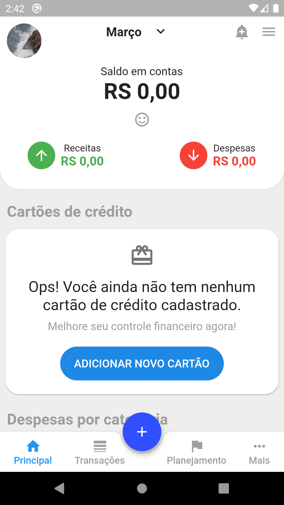

# Mobills Flutter

Clone do aplicativo da [Mobills](https://play.google.com/store/apps/details?id=br.com.gerenciadorfinanceiro.controller&hl=pt_BR) utilizando Dart e Flutter.

### Prévia
|         |            |
| :---: |:---:|
|  |  |
|      |    |

Postagem no [LinkedIn](https://www.linkedin.com/posts/robsonsilv4_flutter-desafio-mobills-activity-6644069515015581696-88FU).

### Configurando o projeto
Clone o projeto utilizando SSH ou HTTPS:
```shell script
# SSH
git clone git@github.com:robsonsilv4/mobills-flutter.git signin mobills_flutter
# HTTPS
git clone https://github.com/robsonsilv4/mobills-flutter.git mobills_flutter

# É importante renomear o nome projeto para mobills_flutter! 
```

Depois basta entrar na pasta do projeto e baixar os pacotes:
```shell script
cd mobills_flutter
flutter packages get
```

Desenvolvido por [Robson Silva](https://www.linkedin.com/in/robsonsilv4/).

Licença MIT.